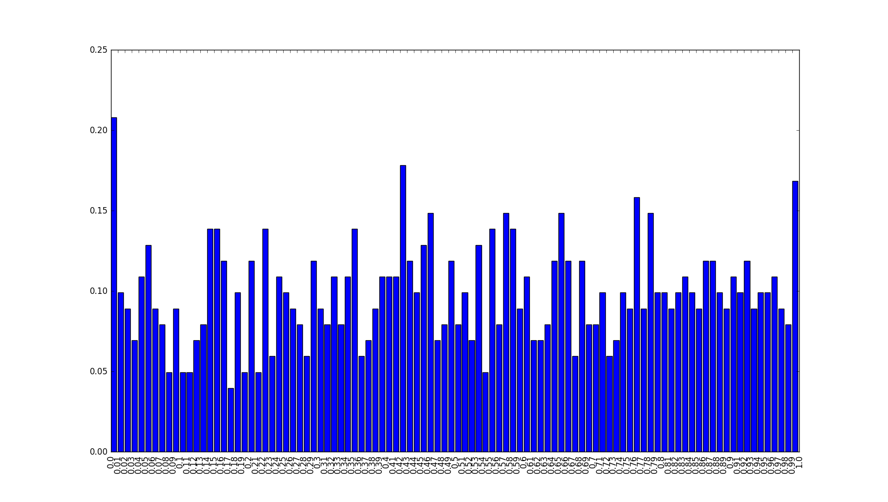

[Think Stats Chapter 4 Exercise 2](http://greenteapress.com/thinkstats2/html/thinkstats2005.html#toc41) (a random distribution)

# PMF and CDF of random.random()  

This exercise generates a thousand numbers using the ```random.random()``` function - uniformly returns a floating point number in the interval 0 to 1. We then plot this Series' Probability Mass Function (PMF) and Cummulative Distribution Function (CDF) to make determinations about its distribution.  

## Generate Random Series  

First, I generate a 1000 random numbers and store it in a pandas Series object.  
```python
s = pd.Series([random.random() for _ in range(0,1000)])
```   

# PMF  

Since we're dealing with a *continuous* variable, plotting a Probability Mass Function for each value does not make much sense as they'll each most likely have a probability of 1, assuming that the random generator works uniformly. To see this, let's *bin* our series into a 100 intervals between 0 and 1000 and count the values that fall into each of these intervals:  

```python
n, bins, patches = plt.hist(s, bins=len(s)/10, normed = False)

#bucket each value into a bin, with the probabilities representing the frequency of counts of bins divided by total bins:
fdict = pd.DataFrame({ 'IntProb' : pd.Series(n/len(bins)), 'Interval' : pd.Series(bins)})
```   

Plotting this PMF with the following code, we get the graph below: 
```python
plt.bar(np.arange(len(fdict)), fdict['IntProb'])
ind=range(0,len(fdict))
plt.xticks(ind, np.round(fdict['Interval'],2), rotation='vertical')
plt.show()
```  



# CDF  

I compute the CDF by computing the percentile ranks for each value in the original series, s, and then plotting the CDF function that maps the percentile rank onto its value.

```python
cdf = pd.DataFrame({'values': sorted(s), 'prcntRank': pd.Series([i/float(len(s)) for i in range(1000)])})
plt.plot(cdf['values'],cdf['prcntRank'])
plt.xlabel('Values from random.random()')
plt.ylabel('CDF: Percentile Rank of Value')
plt.title('CDF of 1000 randomly generated floats from random.random()')
plt.show()
```  
  

That this sdistribution is indeed **uniform** can be confirmed by the fact that he plot is more or less a straight line. For e.g. the value generated at 0.5 does fall in approximately the 50th percentile on teh chart, and so on for other values.  

---  

**End of Report**  

