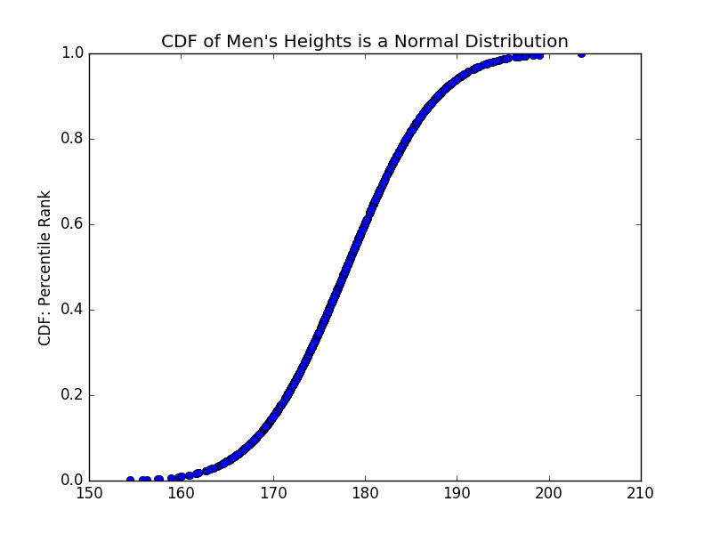

[Think Stats Chapter 5 Exercise 1](http://greenteapress.com/thinkstats2/html/thinkstats2006.html#toc50) (blue men)

# % of Population Qualified for Blue Man Group  

The *Blue Man Group*'s qualification criteria is > In order to join Blue Man Group, you have to be male between 5’10” and
6’1” (see http://bluemancasting.com).  

We want to determine the percentage of US population that s in this range.  

## Generate Data  

The distribution of heights for men is given by a roughly *normal* distribution with mean = 178cm and std. dev. = 7.7cm, whereas for women, its mean = 163cm and std. dev. = 7.3cm. We generate these distributions using the ```scipy.stats.norm``` module.  

```python
mensh = pd.Series(stats.norm.rvs(loc=178, scale=7.7, size=1000))
womensh = pd.Series(stats.norm.rvs(loc=163, scale=7.3, size=1000))
```  

# CDF of Mens Heights  

We now plot a CDF of the generated men's heights:  
```python 
plt.plot(mensh,stats.norm.cdf(mensh,loc=178,scale=7.7), 'bo')
plt.xlabel('Men's Heights (cm)')
plt.ylabel('CDF: Percentile Rank')
plt.title('CDF of Men\'s Heights is a Normal Distribution')
plt.show()
```  



# Eligible Male Population for Blue Man Group  

Given the normal distribution of men's heights, we simply look at the percentile rank of heights that fall between 5'10" - 6'1" feet, which translates to approximenately 177.8cm to 185.4cm.  

```python  
(stats.percentileofscore(mensh, 185.4), stats.percentileofscore(mensh, 177.8))
```  

We observe that about **33.6%** of the US Male population is eligible for the Blue Man group. This lies in the **51.7 to 85.3** percentile of the men's height distribution.  


 

